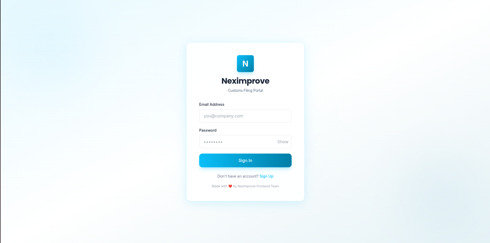
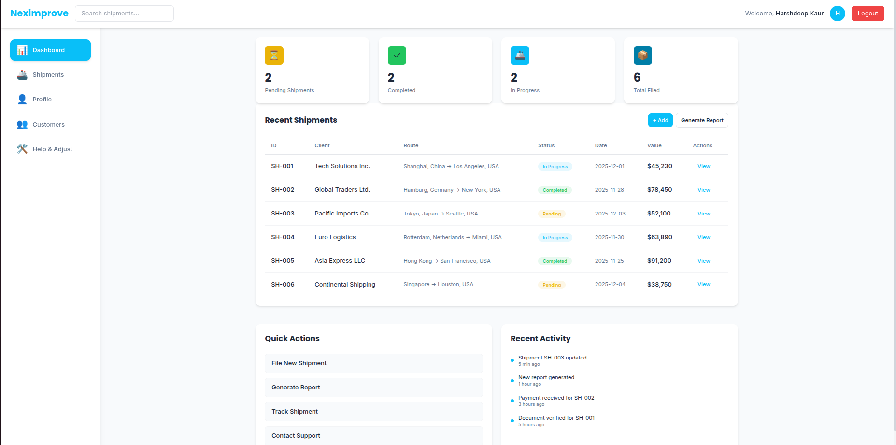
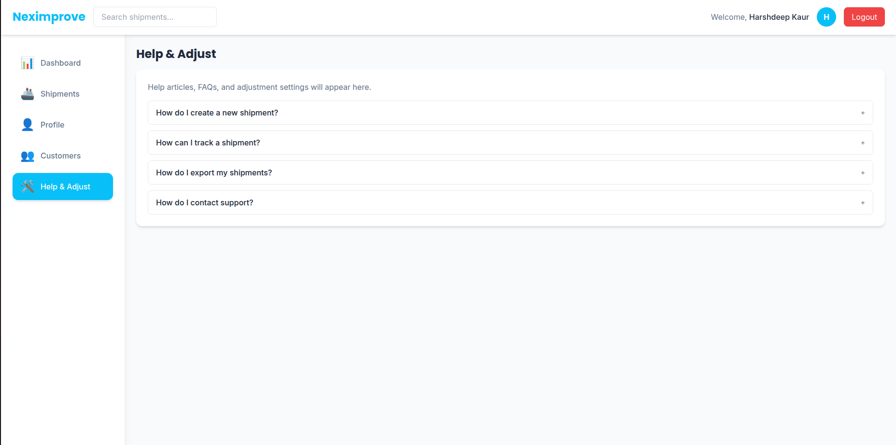

# 🚀 **Neximprove Dashboard — Premium Customs Filing Portal**

A fully responsive, polished **frontend-only web application** built with **React**, **Tailwind CSS**, and **Framer Motion**.
Designed to showcase a **modern SaaS platform** with enterprise-grade UI/UX and high-performance design principles.

---

## 🛠️ **Tech Stack**

* ⚛️ React 19 (with Vite)
* 💨 Tailwind CSS (custom theme + utilities)
* 🌐 React Router DOM
* 🎞️ Framer Motion (smooth animations)
* 🧩 PostCSS + Autoprefixer

---

## ✨ **Features**

### 🎨 **Premium Visual Design**

* Subtle dotted grid background with circular gradient halos (tech SaaS aesthetic)
* Custom shadows with refined blur and opacity

  ```
  shadow-[0_4px_25px_rgba(0,0,0,0.08)]
  ```
* Gradient borders with hover micro-animations
* Brand-consistent color scheme:

  * Primary Cyan: `#00AEEF`
  * Secondary Blue: `#007EA7`

---

### 🔐 **Login Page**

* Modern layout with polished logo and gradient background
* Spring animation for logo entry
* Form inputs with:

  * Mail & Lock icons
  * Brand-colored focus rings
  * Show/Hide password toggle
* Real-time validation with animated inline error messages
* Gradient sign-in button with hover scale effect
* Footer caption: *“Made with ❤️ by Neximprove Frontend Team”*

---

### 📊 **Dashboard**

* Responsive **sidebar navigation** (collapses on mobile)
* Four animated **stat cards** showing mock shipment metrics
* **Recent shipments table** with colored status badges
* Quick Actions & Activity Feed sections
* **Modal form** to add new shipments
* Fully optimized for mobile, tablet, and desktop

---

### ⚡ **Performance Optimizations**

* Lazy-loaded Dashboard route
* Lightweight — minimal dependencies, no UI bloat
* Compressed gradients (no background images)
* Semantic HTML with proper ARIA attributes
* Smooth transitions using Framer Motion

---

## 📁 **Project Structure**

```
src/
├── components/
│   ├── Navbar.jsx          # Top header with search & logout
│   ├── Sidebar.jsx         # Collapsible navigation sidebar
│   ├── StatWidget.jsx      # Animated stat cards
│   ├── DashboardCard.jsx   # Reusable card container
│   └── Modal.jsx           # Form modal component
├── pages/
│   ├── Login.jsx           # Premium login page
│   └── Dashboard.jsx       # Full dashboard layout
├── data/
│   └── dummyData.js        # Mock shipments & stats
├── App.jsx                 # Router & auth logic
├── main.jsx                # App entry point
└── index.css               # Tailwind config & custom styles
```

---

## 🎯 **Key Enhancements**

| Feature                  | Implementation                                                                                              |
| ------------------------ | ----------------------------------------------------------------------------------------------------------- |
| **Background Pattern**   | `background-image: radial-gradient(rgba(0,174,239,0.08) 1px, transparent 1px); background-size: 30px 30px;` |
| **Card Shadows**         | `shadow-[0_4px_25px_rgba(0,0,0,0.08)] hover:shadow-[0_8px_35px_rgba(0,174,239,0.15)]`                       |
| **Gradient Buttons**     | `bg-gradient-to-r from-[#00AEEF] to-[#007EA7] hover:scale-[1.02] transition-transform duration-200`         |
| **Input Icons & States** | Mail/Lock icons, focus rings, inline validation                                                             |
| **Accessibility**        | ARIA labels, semantic tags, keyboard navigation                                                             |

---

## 🎨 **Color Palette**

| Role             | Color     | Usage                   |
| ---------------- | --------- | ----------------------- |
| **Primary**      | `#00AEEF` | Buttons, links, accents |
| **Secondary**    | `#007EA7` | Hover states            |
| **Background**   | `#FFFFFF` | Main body               |
| **Card BG**      | `#F8FAFC` | Panels, sections        |
| **Heading Text** | `#1E293B` | Headings                |
| **Subtext**      | `#64748B` | Paragraphs              |
| **Success**      | `#22C55E` | Approved / Completed    |
| **Warning**      | `#EAB308` | Pending status          |

---

## 📱 **Responsive Layout**

| View                      | Behavior                                  |
| ------------------------- | ----------------------------------------- |
| **Mobile (<768px)**       | Sidebar collapses into top nav            |
| **Tablet (768px–1024px)** | 2-column grid for cards                   |
| **Desktop (>1024px)**     | Full layout with sidebar & 4-column stats |

---

## 🧪 **Testing Instructions**

1. Open deployed app: [**Live Demo Link**](https://neximprove.netlify.app/)
2. **Login:** use any email (e.g., `test@example.com`) and password (min 6 chars)
3. **Dashboard:** explore stat cards, shipments table, and modal
4. **Error Handling:** try invalid credentials
5. **Responsiveness:** resize browser or test on mobile view

---

## 🎓 **Learning Highlights**

This project demonstrates:

* ✅ Component-driven architecture and reusability
* ✅ Custom Tailwind configuration and theming
* ✅ Framer Motion animation integration
* ✅ Frontend form validation
* ✅ Responsive grid and flex layouts
* ✅ Client-side routing and optimization

---

## 🚀 **Quick Start**

```bash
# Clone repository
git clone <your_repo_url>
cd neximprove-dashboard

# Install dependencies
npm install

# Run development server
npm run dev

# Build for production
npm run build

# Preview production build
npm run preview
```

The app will be served locally at **[http://localhost:5173](http://localhost:5173)**

---

## 🧠 **Future Enhancements**

* 🔐 Integrate real backend (Node.js + Express)
* 🌐 Implement Google OAuth 2.0 sign-in
* 📊 Add data visualization with Recharts or Chart.js
* 🌙 Light/Dark mode toggle

---

## 📄 **License**

**MIT License**
Created with ❤️ by **Harshdeep Kaur**

---

## 👤 **Developer**

**Harshdeep Kaur**
Frontend Developer | MERN Stack Enthusiast
📧 [harshdeepkaur@gmail.com](mailto:harshdeepkaur1208@gmail.com)
🔗 [GitHub Profile](https://github.com/24-Harshdeep)
🔗 [LinkedIn](https://www.linkedin.com/in/harshdeep-kaur-58b5a4320/)

---

### ✅ **Submission Summary**

* **GitHub Repo:** [https://github.com/24-Harshdeep/Task1.git]
* **Live Demo:** [https://neximprove.netlify.app/]
## 📸 Screenshots

### 🔐 Login Page


### 🔐 Login Page


### 📊 Dashboard


### 💼 Shipment Section


### 🎨 Customer Section


### 📦 Help section



